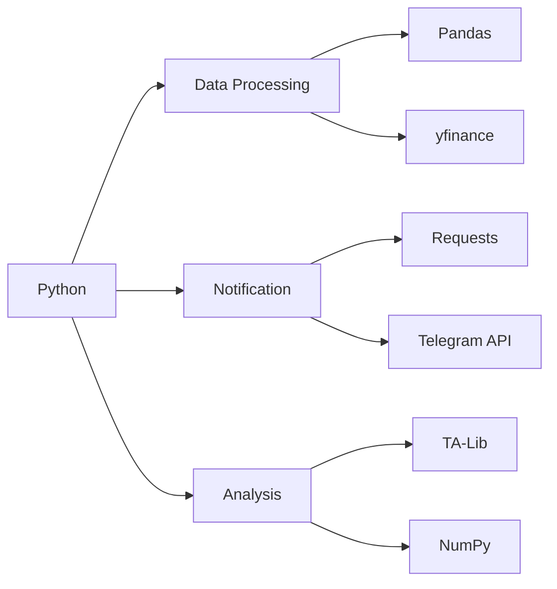

# 📈 IDX Stock Signal Scanner Bot for Telegram

<div align="center">

  
  
  
  
</div>

## 🌟 Key Features

### 🔍 Intelligent Scanning
- 🕒 Automated daily scanning of IDX stocks
- 📈 Technical analysis based on Moving Average crossover
- 🔔 Real-time Telegram notifications

### 📊 Signal Detection Matrix

| Signal Type       | Indicator Pattern      | Confirmation Criteria          |
|-------------------|------------------------|---------------------------------|
| 🟢 **BUY**        | MA5 > MA20 (Golden Cross) | Volume spike + Bullish candle  |
| 🔴 **SELL**       | MA5 < MA20 (Death Cross)  | Volume spike + Bearish candle  |

### 💎 Notification Features
```plaintext
📌 Current Price: RpXXXX
📊 Volume: XXX% above average
📈 MA Levels: MA5 (RpXXXX) | MA20 (RpXXXX)
🎯 Trading Plan (BUY):
  • Entry: RpXXXX
  • Support: RpXXXX
  • Take Profit: RpXXXX (+X%)
  • Stop Loss: RpXXXX (-X%)
⚠️ Warning (SELL):
  • Resistance: RpXXXX
  • Risk Level: High/Medium/Low
````

## 🛠 Technology Stack



## ⚙️ How It Works

### BUY Signal Flow

1.  MA5 crosses above MA20 ✅
2.  Volume \> 20-day average ✅
3.  Bullish candle formation ✅
4.  Price above both MAs ✅
5.  → Triggers BUY alert

### SELL Signal Flow

1.  MA5 crosses below MA20 ✅
2.  Volume \> 20-day average ✅
3.  Bearish candle formation ✅
4.  Price below both MAs ✅
5.  → Triggers SELL alert

## 🚀 Installation Guide

### Prerequisites

  - Python 3.8+
  - Telegram Bot Token
  - Target Channel/Chat ID

### Step-by-Step Setup

```bash
# Clone repository
git clone [https://github.com/Fauziwd/Bot-Saham-Telegram.git](https://github.com/Fauziwd/Bot-Saham-Telegram.git)
cd Bot-Saham-Telegram

# Install dependencies
pip install -r requirements.txt

# Configure settings
cp config.example.py config.py
nano config.py  # Edit with your credentials
```

### Configuration Options

```python
# Telegram Settings
TELEGRAM_BOT_TOKEN = "Your Own Token"
TELEGRAM_CHAT_ID = "Your Own ID Group Chat"

# Stock Settings
STOCK_LIST = ["BBCA.JK", "BBRI.JK", "BBNI.JK", "BMRI.JK"]
SCAN_INTERVAL = "1d"  # Daily scanning
```

## 🕒 Recommended Usage

  - Best run after market close (4:30 PM WIB)
  - Can be scheduled via:
      - Windows Task Scheduler
      - Linux/Mac cron jobs
      - GitHub Actions (for cloud execution)

<!-- end list -->

```bash
# Manual run
python stock_screener.py

# Scheduled run example (crontab -e)
0 16 * * 1-5 cd /path/to/bot && /usr/bin/python3 stock_screener.py
```

## 📜 License & Disclaimer

```plaintext
MIT License

Copyright (c) 2025 Fauziiwd

⚠️ Important Notice:
1. This bot is for EDUCATIONAL PURPOSES ONLY
2. NOT financial advice
3. ALWAYS do your own research (DYOR)
4. Commercial use PROHIBITED without permission

The developer is NOT RESPONSIBLE for any trading decisions
made based on this bot's signals.
```

-----

<div align="center">

  <h3>🤝 Contributing</h3>
  <p>We welcome contributions! Please open an issue or PR.</p>
  
  <a href="https://github.com/Fauziwd/Bot-Saham-Telegram/issues">
    
  </a>
  <a href="https://github.com/Fauziwd/Bot-Saham-Telegram/issues">
    
  </a>

  ---

  <p>Made with ❤️ by Fauziwd</p>
  
</div>
